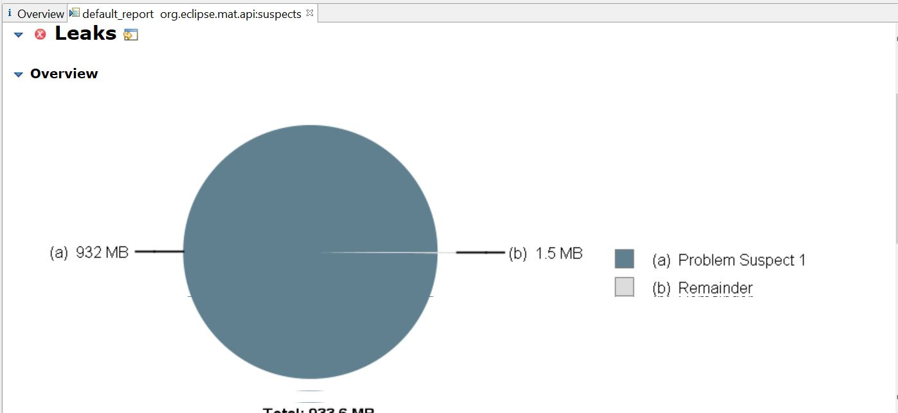
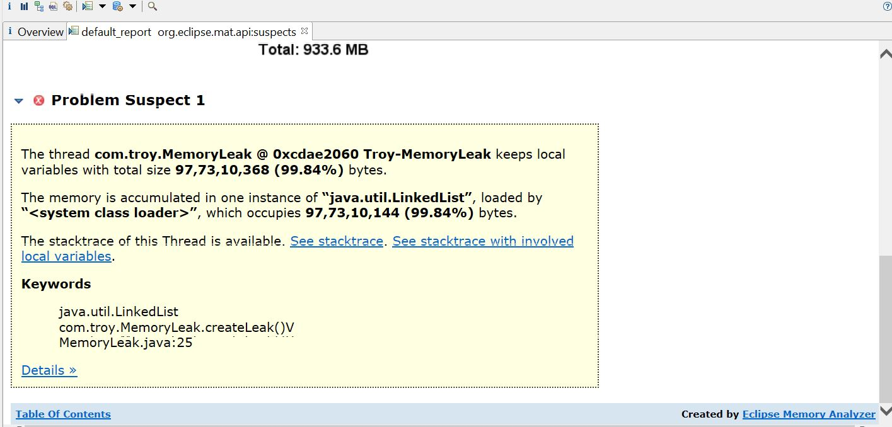

## Out Of Memory(OOM) Reasons
1) Miscalculation of load/required heap size.
2) Non optimized Garbage Collection.
3) Improper memory configuration.
4) Bad code/design.

All of these reasons can be detected during load test bench marking, however code bugs can bring down any strong infrastructure. This requires code change to fix the issue.

## Steps To Collect Evidences
To investigate OOM, we need heap hump. Heap dump is a snapshot of current heap, which include all references to object & threads.
There are several ways to collect dump, most easy is to enable Java flag _-XX:+HeapDumpOnOutOfMemoryError_. This flag enable auto dump creation at time when OOM detected by JVM. 

Note : size of the dump file will be approximately the size of the heap _(-Xmx)_ consumption. 

You can use any Java management utility (jmap / jcmd / JvisualVm / MAT etc) to collect heap dump at runtime.

## Generate OOM
Run the program and generate OOM with below command. Here max heap is set to 1GB (1024MB).
```
java -XX:+HeapDumpOnOutOfMemoryError -XX:VMThreadStackSize=5m -Xss5m -Xmx1024m -XX:MaxMetaspaceSize=55m -jar high-memory-0.0.1-SNAPSHOT-jar-with-dependencies.jar oom
```
This will create a _java_pid<xxxxx>.hprof_ in the current directory.

## Analysis
Now its time analyze the dump with Eclipse MAT. 
1) Configure MAT, edit _MemoryAnalyzer.ini_ file to change MAT java / memory settings.
```
-vm
D:\Software\jdk-11.0.11\bin
-startup
plugins/org.eclipse.equinox.launcher_1.6.200.v20210416-2027.jar
--launcher.library
plugins/org.eclipse.equinox.launcher.win32.win32.x86_64_1.2.200.v20210429-1609
-vmargs
-Xmx3524m
```
2) Start MAT application.
3) Goto windows --> Preferences --> Enable _Keep Unreachable Object_
4) Open the heap dump. This will take few minutes depending on the size of the dump file.
5) Click on the leak suspect report.
Leak Suspect
<picture>
  
</picture>
  
  
Problem Suspect
<picture>
  
</picture>

Here we can clearly see the memory occupied by Linklist objects. And the class name in stack-trace.
```
java.util.LinkedList
com.troy.MemoryLeak.createLeak()V
MemoryLeak.java:25
```
