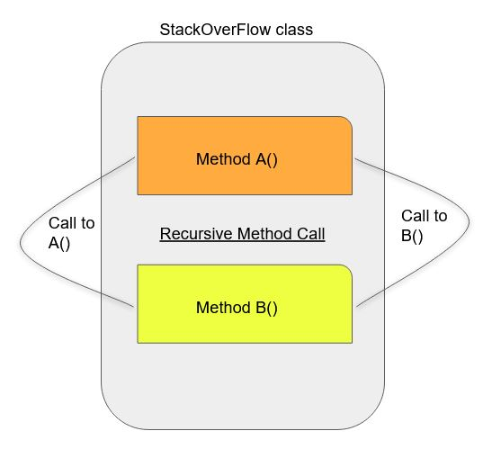

## Stack Size In Java
Thread execution starts with method calls. These calls are kept into stack. 
Default size is 512KB.

## What is Stack Overflow (SoF)
Each method calls are stored in LIFO (last in first out) manner, when number of method call exceed the stack size then stack overflow error thrown.

## Reasons of Stack Overflow
1) Long and too many method call.
2) Recursive method calls.
3) Application requires more than default stack size.

## Generate SOF
Run the program and generate SoF with below command. Here stack size is set to 5MB _(-Xss)_. On windows its depends on OS configuration.
```
java -XX:+HeapDumpOnOutOfMemoryError -XX:VMThreadStackSize=5m -Xss5m -Xmx1024m -XX:MaxMetaspaceSize=55m -jar high-memory-0.0.1-SNAPSHOT-jar-with-dependencies.jar SOF
```

## Analysis
The code will make recursive between two method. Which will exhausted the stack size.
<picture>
  
</picture>
 
```
Generating Stack Overflow...
Exception in thread "main" java.lang.StackOverflowError
        at com.troy.StackOverFlow.methodB(StackOverFlow.java:10)
        at com.troy.StackOverFlow.methodA(StackOverFlow.java:6)
        at com.troy.StackOverFlow.methodB(StackOverFlow.java:10)
        at com.troy.StackOverFlow.methodA(StackOverFlow.java:6)
        at com.troy.StackOverFlow.methodB(StackOverFlow.java:10)
        at com.troy.StackOverFlow.methodA(StackOverFlow.java:6)
        at com.troy.StackOverFlow.methodB(StackOverFlow.java:10)
        at com.troy.StackOverFlow.methodA(StackOverFlow.java:6)
        at com.troy.StackOverFlow.methodB(StackOverFlow.java:10)
        at com.troy.StackOverFlow.methodA(StackOverFlow.java:6)
```
As we can see stack is filed with two method calls to each other and never comes out.

## Solution
During try to increase the _-Xss_ size to a limited extend. If a larger stack is required then involve dev team.
